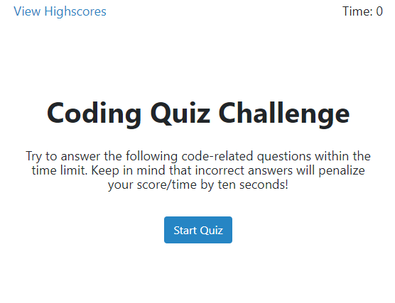
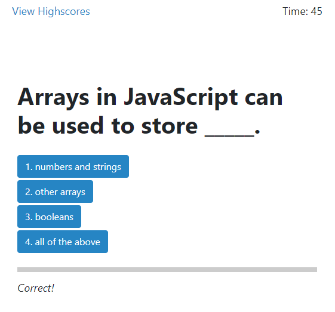
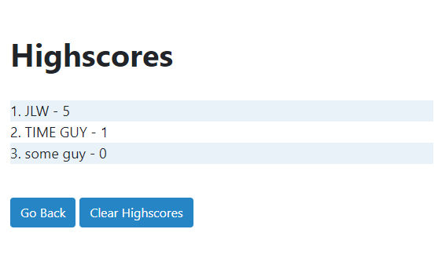

# javascript-basics-quiz

asdf

## Screenshots

Expand/Collapse

###### ~Please don't make me put "^^ ***Click this*** ^^" here everytime~

Deployment: [Javascript Quiz](https://ducktrshessami.github.io/javascript-basics-quiz/)
